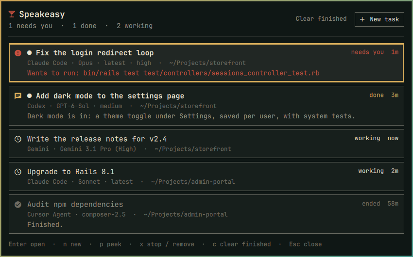
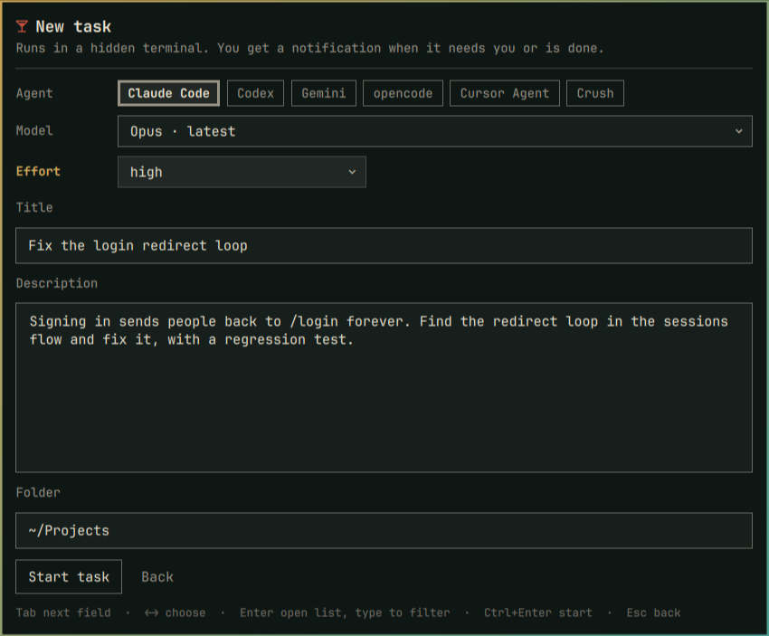
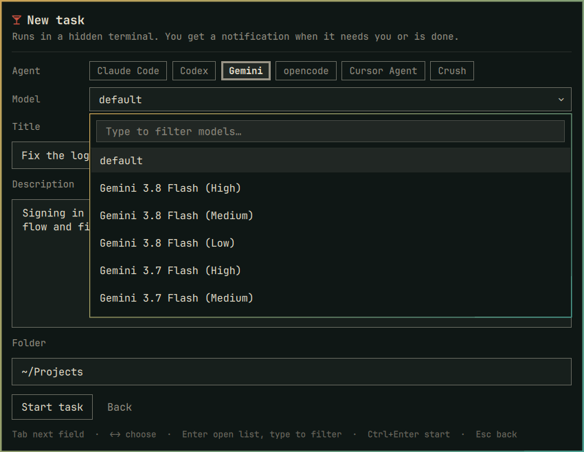
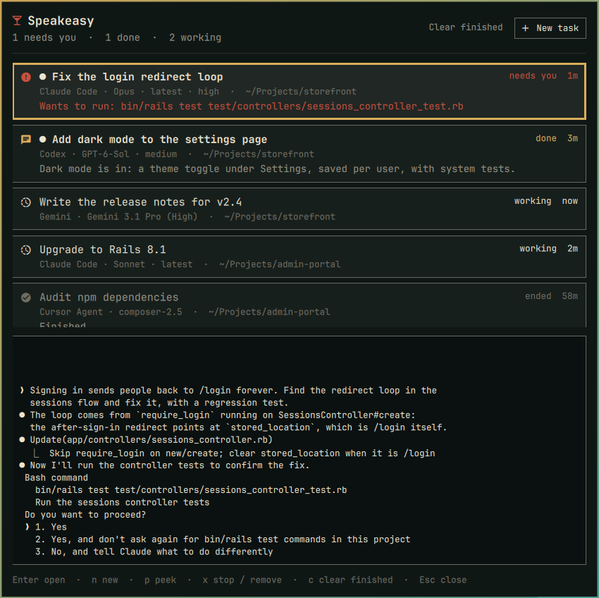

# Speakeasy

**The back room for your AI agents.** Hand Claude Code, Codex, Gemini or
another coding agent a task, give it a name, and it works in a terminal you
never have to look at. The Omarchy bar tells you which tasks are working,
which are done and which need you. A notification taps you on the shoulder
when one wants an approval or has finished, and clicking it opens that task's
terminal. Close the window and the task goes back out of sight, still
running.



Sibling to [Barkeep](https://github.com/ninepointlabs/barkeep) and
[Barback](https://github.com/ninepointlabs/barback): every task is a tab.

## Why

Running three or four agents at once usually means three or four terminal
windows, and within an hour nobody remembers which one is fixing the login
bug, which one is waiting for a yes, and which one finished twenty minutes
ago. Speakeasy keeps the terminals out of sight and gives you one list, by
name, with the ones that need you on top.

## Features

- **Named tasks.** "Fix the login redirect loop", not "terminal 4".
- **Hidden terminals.** Each task is a tmux session on a private socket. No
  window appears until you ask for one; closing the window only hides it.
- **Knows when it needs you.**
  - Claude Code reports through hooks: an approval prompt says what it wants
    to do ("Wants to run: npm test"), and a finished turn shows the first line
    of the answer.
  - Codex reports finished turns through its `notify` program.
  - Other agents are watched for their screen going quiet.
  - First-run questions ("trust this folder?", Codex's hook review) are
    recognised and flagged instead of sitting unnoticed.
- **Notifications that open the right terminal.** Click one and that task's
  terminal opens, or comes to the front if it is already open.
- **Peek without opening.** See the last lines of a task's screen right in the
  panel.
- **Every model on offer.** Claude Code's aliases and pinned versions, the
  models Codex lists for your account, and the models the Antigravity CLI
  lists for your Google account, in a searchable dropdown, with an effort
  setting where the agent has one.
- **Subagents stay invisible.** An agent's own subagents run inside its session;
  you only see the results.
- **Keyboard first.** Everything, from picking a model to confirming a stop,
  works without the mouse.
- **Not only Omarchy.** The engine is one command, `speakeasy`, that runs on
  any Linux with Python 3 and tmux. The bar panel is the Omarchy part.

## Screenshots

| New task | Choosing a model |
|---|---|
|  |  |



## Requirements

| What | Why | Needed? |
|---|---|---|
| Omarchy (Hyprland + the Omarchy shell) | The bar icon, panel and centered window | For the panel |
| Python 3 (standard library only) | The `speakeasy` engine | Yes |
| tmux | Keeps each task's terminal alive and hidden | Yes |
| At least one agent CLI | Something to run: `claude`, `codex`, `agy` (Antigravity CLI), `muse`, `grok`, `copilot`, `hermes`, `cursor-agent`, `opencode`, `crush` | Yes |
| notify-send (libnotify) | Desktop notifications | Recommended |
| A terminal emulator | To show a task when you open it; `xdg-terminal-exec` is used when present | Yes |

Omarchy already ships Python, notify-send and a terminal. If tmux is missing:
`omarchy pkg add tmux`.

## Install

### From the Omarchy plugin marketplace

```bash
omarchy plugin add https://github.com/ninepointlabs/speakeasy
omarchy plugin enable ninepointlabs.speakeasy --section right
```

### From a clone

```bash
git clone https://github.com/ninepointlabs/speakeasy ~/Projects/speakeasy
cd ~/Projects/speakeasy
./install.sh
```

`install.sh` copies the plugin into
`~/.config/omarchy/plugins/ninepointlabs.speakeasy`, enables it on the right
of the bar, and links `~/.local/bin/speakeasy` so the command is on your
`PATH`. Re-run it after pulling changes.

It only replaces what it put there itself. It stops without changing
anything if `~/.local/bin/speakeasy` is something else, if the plugin folder
is a symlink, not yours, or not a Speakeasy install, or if it is a git
checkout made by `omarchy plugin add` (update that with `omarchy plugin
update ninepointlabs.speakeasy`). The new copy is staged, validated and
swapped in with a rename that rolls back on failure.

### Put the command on your PATH (marketplace installs)

The panel does not need this, but the command line is handy:

```bash
ln -s ~/.config/omarchy/plugins/ninepointlabs.speakeasy/bin/speakeasy ~/.local/bin/speakeasy
```

### Keybindings

Add these to `~/.config/hypr/bindings.lua`. They open Speakeasy in the middle
of the focused screen with the keyboard already in it:

```lua
o.bind("SUPER + A", "Speakeasy tasks", "omarchy-shell ninepointlabs.speakeasy present list")
o.bind("SUPER + ALT + A", "Speakeasy new task", "omarchy-shell ninepointlabs.speakeasy present new")
```

`SUPER + A` toggles the task list; `SUPER + ALT + A` goes straight to the
new-task form. Pick other keys if yours are taken (`hyprctl binds` lists them).
If `speakeasy` is on your `PATH`, `speakeasy ui` and `speakeasy ui new` do the
same and fall back to a terminal when the Omarchy shell is not running.

## Using it

### The bar icon

A cocktail glass. Next to it:

- `!2` in your theme's urgent colour: two tasks need you.
- `✓1`: one task finished and you have not looked at it yet.
- A plain number: tasks still working.

Click it for the panel, dropped from the bar. The keybindings show the same
panel centered on the screen instead.

### The task list

Tasks that need you come first, then finished ones you have not seen, then
the ones still working, then the ended ones. Each row shows the agent, model,
effort and folder, and a line of detail: what an approval is for, or the
first line of the answer.

| Key | Does |
|---|---|
| `↑` `↓` (or `j` `k`) | Pick a task |
| `Enter` | Open its terminal (or bring it to the front) |
| `n` | New task |
| `p` | Peek: the last lines of its screen, updated live |
| `x` | Stop a running task, or remove an ended one; press `x`, `Enter` or `y` again to confirm |
| `c` | Clear every ended task |
| `s` | Settings |
| `Esc` | Cancel a confirmation, close the peek, then close the panel |

### Starting a task

| Key | Does |
|---|---|
| `←` `→` | Choose the agent (on the agent row), or step through models or efforts without opening the list |
| `Tab` / `Shift+Tab` | Next / previous field |
| `Enter` on Model or Effort | Open the list; type to filter ("opus", "4.6", "flash"), `↑` `↓` and `Enter` to pick |
| `Enter` in Title | Go to the description |
| `Enter` in Description | New line |
| `Ctrl+Enter` anywhere | Start the task |
| `Esc` | Back to the list |

**Folder.** New tasks start in your default folder (Settings). To work on an
existing project, go to Folder and browse: the list below it shows your
recent task folders, then the subfolders matching what you have typed, like
tab-completion in a shell (`~/Projects/sto` lists what starts with "sto";
git repositories are marked). `↓` `↑` pick one, `Enter` or `→` steps into
it, `Alt+↑` goes up a level, and `Enter` with nothing picked starts the task
there. The mouse works too: click a folder to step into it.

Only agents installed (and not hidden in Settings) are offered. Speakeasy remembers the
last agent, model and effort you used. The title is what the task is
called everywhere: the list, notifications and the terminal's window title.
If you leave it empty, the first line of the description is used.

### When a task needs you

You get a notification ("Fix the login redirect loop needs you: Wants to run:
bin/rails test …"). Click it, answer the agent in its terminal, and close the
window. The task keeps going, and the list shows it working again.

Every task's terminal has a status line at the bottom with its name and
agent, and a reminder that closing the window only hides it.

### Settings

Press `s` in the task list (or the Settings button). `↑` `↓` pick a row and
`Enter` or `Space` changes it:

- **Agents:** every agent Speakeasy knows, installed ones first. Set any of
  them to *Hidden* to keep it out of the new-task picker; installed agents
  you never use stay out of the way.
- **Notifications:** on or off.
- **Default folder:** where new tasks start. `Enter` on the row edits it,
  `Enter` again saves.

Speakeasy looks for installed agents on every refresh (every few seconds
while the panel is open), so an agent you install shows up by itself.

## Agents and models

| Agent | Models offered | Effort | How Speakeasy knows its state |
|---|---|---|---|
| Claude Code (`claude`) | The aliases `fable`, `opus`, `sonnet`, `haiku` (always the newest release), `opusplan`, the 1M-context variants, and pinned versions (Opus 5.5 back to 4.1, Sonnet 5.5 back to 4.5, Fable 5.1, Haiku 4.5) | low, medium, high, xhigh, max | Hooks: approval needed, turn finished, working |
| Codex (`codex`) | Whatever Codex lists for your account, read from `~/.codex/models_cache.json`, which Codex keeps up to date | Each model's own reasoning levels | `notify` (turn finished) and a quiet screen |
| Gemini (Antigravity CLI, `agy`) | Whatever `agy models` lists for your account, refreshed in the background every 6 hours | Part of the model name | Quiet screen |
| Muse (`muse`, Meta's Muse Code) | Muse's own catalog (`~/.local/share/muse/model-catalog/`) | Each model's own levels | Quiet screen |
| Grok (`grok`) | Whatever `grok models` lists for your account, refreshed every 6 hours | — | Quiet screen |
| GitHub Copilot (`copilot`) | The agent's default | none to max | Quiet screen |
| Hermes (`hermes`) | The agent's default (runs `hermes chat`) | — | Quiet screen |
| Cursor Agent (`cursor-agent`) | default, composer-2.5, composer-2.5-fast, gpt-5.5, sonnet-4, opus | — | Quiet screen |
| opencode, Crush | The agent's default (add more in the config) | — | Quiet screen |

"Quiet screen" means the task counts as done, or waiting for you, once its
output has not changed for 20 seconds (configurable). It is a good guess, not
a guarantee; Claude Code and Codex report exactly.

`speakeasy models` prints every agent's list. `speakeasy models antigravity
--refresh` asks Antigravity again right away.

### First-run questions

Agents ask a few one-time questions in a new folder. Speakeasy spots them and
marks the task *needs you* with the question, so open the terminal and answer:

- **Trust this folder?** Claude Code, Codex, the Antigravity CLI, Muse and
  Copilot all ask the first time they run in a folder.
- **Sign in:** an agent whose login has expired shows a browser sign-in code;
  the task says so.
- **Hooks need review** (Codex): Codex asks you to approve hooks from
  `~/.codex/hooks.json` in every new session until you trust them once in
  Codex itself.

## Command line

Everything the panel does goes through `speakeasy`, so it also works on its
own, on any Linux:

```bash
speakeasy new -i                              # asks for agent, model, effort, title, description, folder
speakeasy new -a claude -m opus -e high -t "Fix login" -p "The redirect after login loops…" -C ~/code/app
speakeasy new -a codex -t "From a file" --prompt=- < task.md   # description from a file or pipe
speakeasy list                                # attention first; * marks results you have not seen
speakeasy open login                          # by id, id prefix, or part of the title
speakeasy open next                           # the task that most needs you
speakeasy peek login -n 20                    # last lines of its screen
speakeasy send login "yes, go ahead"          # type a line into it and press Enter
speakeasy rename login "Fix the login loop"
speakeasy stop login                          # stop, keep it in the list
speakeasy rm login                            # stop and remove
speakeasy clear                               # remove every ended task
speakeasy agents                              # which agents are installed, which are hidden
speakeasy agents --hide crush --show codex    # choose what the new-task picker offers
speakeasy set notify off                      # also: default-cwd PATH, quiet-seconds N, terminal CMD
speakeasy models [agent] [--refresh]          # which models each offers
speakeasy ui [new]                            # the panel, or a terminal without Omarchy
```

`speakeasy new` prints the new task's id; add `--json` for the whole record,
or `-o` to open its terminal straight away. Arguments after `--` go to the
agent itself, e.g. `speakeasy new -a claude -t Review -p "…" -- --permission-mode plan`.
Use `--prompt=…` (with `=`) for a description that starts with `-`.

### Other desktops

Without Omarchy there is no bar icon, but everything else works:
notifications (with any notification daemon that supports actions), opening
terminals, and the list. Bind `speakeasy ui new` and `speakeasy ui` to keys in
your desktop; without the Omarchy shell they open a terminal with the
interactive prompts or the list.

```bash
git clone https://github.com/ninepointlabs/speakeasy
cd speakeasy && ./install.sh --cli     # only links ~/.local/bin/speakeasy
```

## Configuration

Optional, in `~/.config/speakeasy/config.json`:

```json
{
  "defaultCwd": "~/Projects",
  "terminal": "ghostty -e",
  "quietSeconds": 20,
  "notify": true,
  "agents": {
    "codex": { "models": ["", "gpt-5.5"] },
    "gemini-cli": { "name": "Gemini CLI", "bin": "gemini", "modelFlag": "--model", "prompt": "flag:--prompt-interactive", "models": [""] },
    "aider": { "name": "Aider", "bin": "aider", "modelFlag": "--model", "prompt": "flag:--message", "models": [""] }
  }
}
```

| Key | Meaning |
|---|---|
| `defaultCwd` | Folder new tasks start in when none is given |
| `terminal` | Command prefix used to show a task; the tmux attach command is appended. Empty: `xdg-terminal-exec`, then the first common terminal found |
| `quietSeconds` | How long a watched agent's screen must be still before it counts as done or waiting |
| `notify` | `false` turns notifications off |
| `agents` | Override a built-in agent (any field) or add your own |
| `hiddenAgents` | Agent ids left out of the new-task picker (Settings changes this) |

An agent entry takes `name`, `bin`, `models` (`""` is the agent's default),
`modelLabels`, `modelFlag` (passed as `<flag>=<model>`), and `prompt`: `keys`
(the default: typed into the agent once it is ready), `arg` (the last
argument, after `--`), or `flag:<name>` (passed as `<name>=<prompt>`). `arg`
and `flag:` put the prompt in the agent's process arguments, where other
users on the machine can see it; every built-in agent uses `keys`.

## How it works

- Each task is a JSON file in `~/.local/state/speakeasy/tasks/`. The command
  touches `~/.local/state/speakeasy/rev` on every change, and the panel watches
  that file, so the bar updates the moment a hook fires.
- Each task runs in `tmux -L speakeasy` (a private server, separate from any
  tmux you use) in a session called `se-<id>`, with a small generated config:
  mouse on, a status line with the task's name, and finished panes kept so you
  can read the final output.
- A small wrapper starts the agent inside that session, records its exit, and,
  for agents without hooks, watches the screen for going quiet.
- Claude Code gets its hooks through `--settings` for that session only. Your
  own Claude settings files are not touched. Codex gets its `notify` program
  through `-c` the same way.
- `open` attaches a terminal to the session. On Hyprland it focuses a window
  that is already showing the task instead of opening a second one.
- The Antigravity model list is cached in `~/.local/state/speakeasy/models/`.

## Security and privacy

- Nothing leaves your machine except what the agents themselves send. Speakeasy
  makes no network requests of its own.
- Task records hold your prompts, so Speakeasy's folders are created `0700`
  and its files `0600`: other users on the machine cannot read them. Folders
  and files left by version 0.1 are tightened on the next run.
- Prompts and titles never appear in a process's arguments (which any user can
  see with `ps`). Speakeasy types the prompt into the agent's terminal through
  a tmux paste buffer fed on stdin, once the agent is ready: after any trust,
  sign-in or other question on its screen has been answered, so a prompt is
  never typed into a menu. Notification text reaches the notifier over stdin
  and D-Bus in the same way. One exception is outside Speakeasy's hands:
  Codex hands its turn summary to Speakeasy's hook as an argument (that is
  how Codex's `notify` works); the hook reads it and exits at once.
- Every program is started with an argument list, never through a shell.
  Titles, descriptions and model names are passed as `--flag=value` or after
  `--`, so text that starts with `-` can never turn into an agent option.
- Model names read from other programs (`agy models`, Codex's cache) must look
  like model names or they are ignored. Task ids must be six hex digits before
  they are used in a file path.
- The hooks Speakeasy gives Claude Code only record state and send
  notifications. They never approve anything; approvals are always yours.
- Task records hold the title, description, folder and last status line. They
  stay in `~/.local/state/speakeasy/`.

## Troubleshooting

- **The icon is not on the bar.** `omarchy plugin list | grep speakeasy`
  should say *enabled*; if not, `omarchy plugin enable ninepointlabs.speakeasy
  --section right`.
- **"Speakeasy needs tmux".** `omarchy pkg add tmux`.
- **A task says *needs you* but the notification is gone.** Notifications that
  time out cannot be clicked from the history; open the task from the list.
- **A task stays *starting*.** Open it: the agent is probably asking a
  first-run question.
- **The panel looks stale after an update.** `omarchy restart shell`.
- **A task shows "terminal is gone".** Its tmux session ended (after a reboot,
  say). Remove it with `x`.

## Uninstall

```bash
tmux -L speakeasy kill-server                 # stops every running task
omarchy plugin remove ninepointlabs.speakeasy
rm -f ~/.local/bin/speakeasy
rm -rf ~/.local/state/speakeasy ~/.config/speakeasy
```

Then delete the two Speakeasy lines from `~/.config/hypr/bindings.lua`.
Speakeasy writes nothing else: the agents' own settings are left as they were.

## Development

```bash
python3 -m unittest discover -s test -v       # the engine: commands, hooks, models, a tmux run
./install.sh && omarchy restart shell         # try panel changes
```

The panel can be driven over IPC for testing: `omarchy-shell
ninepointlabs.speakeasy status`, `present list|new`, `key <name>` (`down`,
`enter`, `n`, `p`, `x`, `tab`, `open`, `focus:<n>`, `title:<text>`, …), and
`capture <list|new> <screen> <state-dir>` with `cardGeometry`, which is how the
screenshots above were taken (from a demo task list, without taking the
keyboard).

## Licence

MIT. See [LICENSE](LICENSE).
